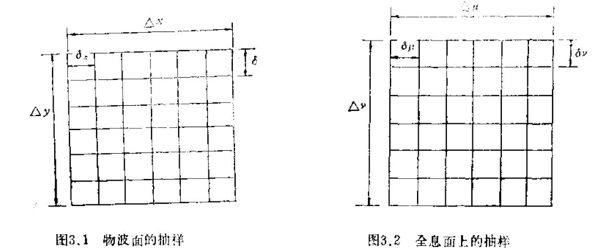
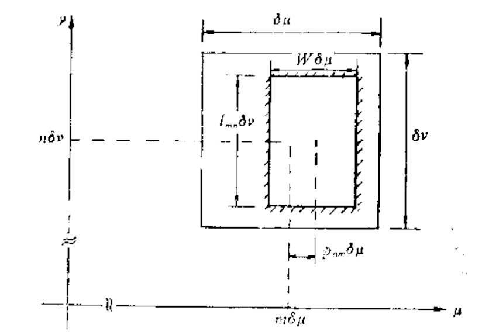

# Before Read

注：此文档分中英文撰写，根据需要跳转到相应位置阅读

Note: This document is written in Both Chinese and English, skip to the corresponding location to read if necessary

# 迂回位相型全息图

## 什么是迂回位相型全息图？

1960年，布朗恩( Brown)和罗曼应用迂回位相技术制成二元计算全息图，现在习惯称之为迂回位相型全息图。这种全息图有三个特点：

1. 全息图的透过率是二元的，即只取0或1。
2. 应用迁回位相编码物光波的位相，全息图可以同时记录复值函数的振幅和位相。
3. 全息图记录时没有用到参考光波或加偏分量。

这种迁回位相编码制作的二元计算全息图是计算全息的开创篇，正是它的特点使得它在后来的很多编码技术中得到了广泛的使用。

## 原理

二元付里叶变换计算全息图的制作过程一般分为四个步骤：

### 物面和全息面的抽样

在把物面信息输入计算机作离散付里叶变换之前，要先对物面和全息面分别按抽样定理进行抽样，求出各样点的幅值和位相信息。

物面函数：
$$
f(x, y)=a(x, y) \exp [j \phi(x, y)]
$$
傅里叶变换：
$$
F(\mu, v)=A(\mu, v) \cdot \exp [j \Phi(\mu, \nu)]
$$
即物函数$f(x,y)$在空间中大小是有限的。同时从物理意义上来说，它在空间域频率也是近似有限的。可以这样来理解，即物函数在空间是缓慢变化的，故其空间频率域中的高频部分可近似为零。

具体的抽样过程如图所示：

### 计算离散傅里叶变换（DFT）

由于制作的是付里叶变换全息图，故要算出全息图面上谱的复振幅分布$F(\mu, v)$，必须进行离散的付里叶变换。离散的付里叶变换可写成下式：
$$
F(u, v)=1 / M N \sum_{x=0}^{M-1}\left[\sum_{y=0}^{N-1} f(x, y) \exp (-j 2 \pi v / N)\right] \exp (-j 2 \pi c x / M)
$$

### 编码

即将算出的全息图面上样点处的幅值和位相，仍在计算机内进行编码处理，然后把编码后的信息输给绘图仪绘图，或由微密度计显示产生计算全息原图。由编码理论，可知编码的目的是要把复数值转变为实的非负函数。在迂回位相二元全息图中，罗曼等人是用下述精巧的方法分別编码振幅和位相的。在全息图的每个抽样单元中，放置一个通光孔径，改变此通光孔径的面积来调制波面的幅值，改变通光孔径中心距抽样单元中心的位置来编码波面的位相。通光孔径的形状可以是多种多样的，这主要依据绘图仪的作图能力和数学描述的方便来取定。在罗曼等人的工作中，选择了矩形孔径。矩形孔的可变参数可以有好几个，但由于只编码幅值和位相，故孔径的变参数仅取两个。罗曼编码方式分为Ⅰ型、Ⅱ型、Ⅲ型。

以罗曼Ⅲ型为例，处理方法如图：

### 绘图显示

当计算机已经完成幅值和位相编码后，下一步就是制作计算全息原图并把它缩小到合适的尺寸。绘图仪、阴极射线管、或计算机控制的微密度计都可用来制作原图。光学缩版后就变成实际可用的计算全息片了。如果采用特殊的输出（如电子束）直接把全息图记录在胶片上，就可省去制作原图和缩版的步骤，这样全息图的制作再现精度会更高些。

## 如何制作迂回位相型全息图？

在这个实验中，我们使用这个图像进行测试:

这里提供了两种进行实验的方法，Matlab或Python，您可以选择熟悉的方法来运行代码。

- 运行[`fourier_hologram.m`](../../Matlab/fourier_hologram.m) 或 [`fourier_hologram.py`](../../Python/fourier_hologram.py)，它们分别在Python和Matlab文件夹中。

- 然后你会在下面得到Circuitous Phase Type Hologram/Fourier Hologram。

+ 最后，运行程序后，可以得到复现的图像，并将其与原始图像进行比较。

# Circuitous Phase Type Hologram

## What is Circuitous Phase Type Hologram?

In 1960, Brown and Roman used devolution phase technology to make binary computed holograms, now commonly known as devolution phase holograms. This hologram has three characteristics:

1. The transmittance of holograms is binary, that is, 0 or 1.

2. The hologram can record both the amplitude and the phase of the complex function by reverting to the phase of the object light wave.

3. No reference light wave or offset component is used in hologram recording.

This kind of binary CGH is the first part of CGH. It is its characteristic that makes it widely used in many coding technologies.

## Principle

The production process of binary Fourier transform CGH is generally divided into four steps:

### Sampling of object and holographic surfaces

Before input the information of object plane into computer for discrete Fourier transform, the object plane and holographic plane should be sampled respectively according to sampling theorem, and the amplitude and phase information of each point can be obtained.

Object surface function:

$$
f(x, y)=a(x, y) \exp [j \phi(x, y)]
$$

Fourier transform:

$$
F(\mu, v)=A(\mu, v) \cdot \exp [j \Phi(\mu, \nu)]
$$

That is, the matter function $f(x,y)$is finite in space. At the same time, in a physical sense, its frequency in the space domain is approximately finite. It can be understood that the matter function changes slowly in space, so the high frequency part of its spatial frequency domain can be approximately zero.

The specific sampling process is shown in the figure:

### Compute the Discrete Fourier Transform (DFT)

A discrete Fourier transform is necessary to calculate the complex amplitude distribution $F(\mu, v)$of the hologram. The discrete Fourier transform can be written as follows:

$$
F(u, v)=1 / M N \sum_{x=0}^{M-1}\left[\sum_{y=0}^{N-1} f(x, y) \exp (-j 2 \pi v / N)\right] \exp (-j 2 \pi c x / M)
$$

### Codes

The amplitude and phase of the sample point on the hologram plane to be calculated are still coded in the computer, and then the coded information is transferred to the plotter for drawing, or the original cHOLogram is generated by the micro-densitometer display. From coding theory, we know that the purpose of coding is to transform complex values into real non-negative functions. In a roundabout phase binary hologram Roman et al. coded the amplitude and phase separately in the following ingenious way. In each sampling element of the hologram, an aperture is placed, the amplitude of the wave surface is modulated by changing the area of the aperture, and the phase of the wave surface is encoded by changing the position between the center of the aperture and the center of the sampling element. The shape of aperture can be various, which is mainly based on the plotting ability of plotter and the convenience of mathematical description. In the work of Roman et al., rectangular apertures were chosen. There can be several variable parameters of rectangular hole, but only two variable parameters of aperture are selected because only amplitude and phase are encoded. Romanesque coding is divided into type ⅰ, type ⅱ and type ⅲ.

Taking Roman ⅲ type as an example, the treatment method is shown as follows:

### Drawing and Display

Once the computer has encoded the amplitude and phase, the next step is to make the CGH original and reduce it to the right size. Plotters, cathode-ray tubes, or computer-controlled microdensitometers can be used to make original drawings. The optical version is reduced to a practical CGH. If a special output (such as an electron beam) is used to record the hologram directly on the film, the process of making the original image and reducing the size of the hologram can be eliminated and the reproduction of the hologram will be more accurate.

## How to make Circuitous Phase Type Hologram?

Circuitous Phase Type Hologram/Fourier Hologram is Binary hologram.

For this experiment we used this image for testing

Two ways to do experiments are provided here, Matlab or Python, and you can choose the familiar way to run the code.

- Run the `fourier_hologram.m` or `fourier_hologram.py`, They are in the Python and Matlab folders respectively.
- Then you will get Circuitous Phase Type Hologram/Fourier Hologram below.

+ Finally, after running the program, you can get the reproduced graph and compare it with the original image.

