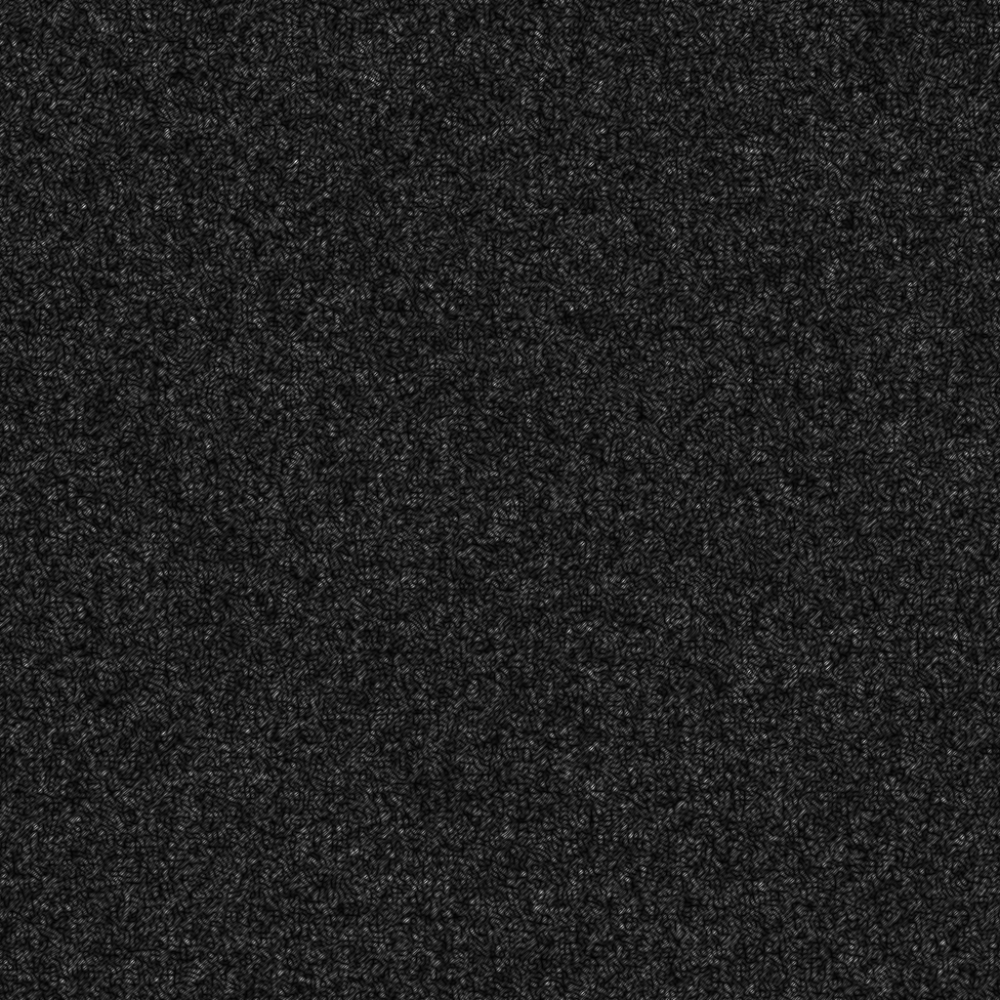

# Before Read

注：此文档分中英文撰写，根据需要跳转到相应位置阅读

Note: This document is written in Both Chinese and English, skip to the corresponding location to read if necessary

# 计算全息干涉图

## 什么是计算全息干涉图？

干涉是光学中的基本现象，相干的双光束或多光束叠加就形成干涉条纹。以往的干涉都是应用光学方法来实现，但光学的干涉图却完全可用计算来仿真( simulation)，即计算机产生的干涉图。全息摄像主要经历光学全息，数字全息，和计算全息这样几个过程，其基本原理都是通过干涉纪录及衍射重建。当两束光波进行干涉时，记录物体的振幅和相位信息，通过衍射计算，重构物体的振幅和相位信息。

用计算机模拟产生光学干涉图，只预先知道干涉图样的数学模式即可。但是一般的光学干涉图，其透过率是连续变化的函数，而用计算机输出的数字讯号经绘图仪或CRT显示来制作的计算全息，干涉图，常常希望只得到二元透过率(取0或1值)，即二元计算全息干涉图。为了达到这一目的，就必须把连续透过率函数进行非线性变换，转化成二元形式，而且此二元形式的干涉图仍应保存物波的全部信息，在再现时能得到所需的物光波。

## 原理

普通的离轴型光学全息图，可以把它看成是物光和参考光“双光束”相叠加而形成的干涉图，其透过率为
$$
\begin{aligned}
h(x, y) &=|R \exp (j 2 \pi x / T)+A(x, y) \exp (j \phi(x, y))|^{2} \\
&=R^{2}+|A(x, y)|^{2}+2 R A(x, y) \cos (2 \pi x / T-\phi(x, y))
\end{aligned}
$$
其中，$R \exp (j 2 \pi x / T)$为参考光复振幅，$A(x, y) \exp (j \phi(x, y))$为物光复振幅。

当物光仅仅只有相位变化时，上式可简化为：
$$
h(x, y)=\frac{1}{2}(1+\cos \{2 \pi x / T-\phi(x, y)\})
$$
根据上式可以得出振幅最大值和最小值位置，得到干涉条纹。但是透过率是连续的，干涉条纹的对比是不高的。如果只是为了要提高条纹的对比，以致在极端的情况下能产生二元值化(0,1)的条纹，一种方法是可以用多光束相干涉，当参加干涉的光束数越多时，条纹就越锐，逐渐趋向于二元形式，这时的透过率函数可写成多光束迭加求和的形式。另一常规的方法是用高反差的胶片来记录此干涉条纹，这种高反差胶片的硬限幅特性能把连续色调的干涉条纹变成二元干涉图。后一种方法启示我们，若要计算机来制作二元计算全息干涉图，可以借用电讯系统中的非线硬限幅器的模型来进行处理。

我们举三个例子来说明二元计算全息图的制作技术及其再现情况。这三个例子都是记录的位相型波面，它们在光学干涉量度中有很大的应用价值。其中第一个例子是球面波，它通常在光学中是由透镜或波带板状得到的；第二个例子是锥形波面，也可由光学的旋转三棱镜获得；而第三个例子是螺旋形波面，其位相在方位方向上是线性变化的，这种波面用通常的光学元件却是得不到的。故最后一个例子说明了，由于计算机仿真干涉图的灵活性大，我们完全可以得到用光学制作技术难以得的特殊位相型变化波前。这使得计算全息干涉图很适用于光学的量度术中去检特殊的光学波面。

**球面波**

球面波的位相变化为：
$$
\phi(x, y)=\frac{k}{2 f}\left(x^{2}+y^{2}\right)
$$
其中，$k=\frac{2 \pi}{\lambda}$，$f$是球面波曲率半径。

计算得到条纹数：
$$
N_{p}=\left.\phi(x, y)\right|_{\max }=\frac{\pi \cdot \frac{D^{2}}{4}}{\lambda \cdot f \cdot 2 \pi}=\frac{D^{2}}{8 \lambda f}=\frac{N}{16}
$$

**锥形波面**

锥形面波的位相变化为：
$$
\phi(x, y)=2 \pi r / r_{0}
$$
其中，$r=\left(x^{2}+y^{2}\right)^{1 / 2}$。

计算得到条纹数：
$$
N_{\mathrm{p}}=\frac{D}{2 \cdot r_{0}}=\frac{N}{8}
$$

**螺旋形波面**

相对变化：
$$
\phi(x, y)=2 \pi \theta / \theta_0
$$
其中，$\theta=\tan ^{-1} y / x$

## 如何制作计算全息干涉图？

在这个实验中，我们使用这个图像进行测试：

这里提供了两种进行实验的方法，Matlab或Python，您可以选择熟悉的方法来运行代码。

- 运行[`offaxis_interference_hologram.m`](../../Matlab/offaxis_interference_hologram.m) 或 [`offaxis_interference_hologram.py`](../../Python/offaxis_interference_hologram.py)，它们分别在Python和Matlab文件夹中。

- 然后你会在下面得到Off Axis Interference Hologram。

- 最后，运行程序后，可以得到复现的图像，并将其与原始图像进行比较。

# Computational Interference Holograms

## What is Computational Interference Holograms？

Interference is a basic phenomenon in optics. Interference fringes are formed when two or more coherent beams are superimposed. In the past, interference is realized by optical method, but the optical interferogram can be completely simulated by calculation, that is, the interferogram generated by computer. Holography mainly goes through optical holography, digital holography and computational holography. The basic principle of holography is interference recording and diffraction reconstruction. When two light waves interfere, the amplitude and phase information of the object are recorded, and the amplitude and phase information of the object are reconstructed by diffraction calculation.

To produce optical interferograms by computer simulation, only the mathematical pattern of interference pattern is known in advance. However, the transmittance of general optical interferogram is a function of continuous change, while the computed hologram (CGH), which is made by using the digital signal output by computer and displayed by plotter or CRT, usually hopes to get only binary transmittance (0 or 1), namely binary CGH interferogram. In order to achieve this goal, it is necessary to transform the continuous transmittance function into a binary form by nonlinear transformation, and the binary interferogram should still preserve all the information of object wave, so as to obtain the desired object wave when reproducing.

## Principle

The common off-axis optical hologram can be regarded as an interferogram formed by the superposition of object light and reference light "double beam", and its transmittance is

$$
\begin{aligned}

h(x, y) &=|R \exp (j 2 \pi x / T)+A(x, y) \exp (j \phi(x, y))|^{2} \\

&=R^{2}+|A(x, y)|^{2}+2 R A(x, y) \cos (2 \pi x / T-\phi(x, y))

\end{aligned}
$$

Where,$R \exp (j 2 \pi x / T)$is the reference light recovery amplitude and i$A(x, y) \exp (j \phi(x, y))$s the object light recovery amplitude.

When the object light only changes in phase, the above equation can be simplified as:

$$
h(x, y)=\frac{1}{2}(1+\cos \{2 \pi x / T-\phi(x, y)\})
$$

According to the above formula, the position of the maximum and minimum amplitude can be obtained, and the interference fringe can be obtained. But the transmittance is continuous and the contrast of interference fringes is not high. If only in order to improve the contrast of stripe, so that in extreme cases can generate binary value (0, 1) stripes, a kind of method is you can use multiple beam interference, when attend the more the number of beam interference stripe is more sharp, gradually tend to be binary form, the transmittance function can be written in the form of multiple beam superposition summation. Another conventional method is to record the interference fringes on high-contrast film. The hard limiting property of this high-contrast film can transform the continuous tone interference fringes into binary interferograms. The latter method suggests that the model of non-linear hard limiter in telecommunication system can be used to make binary CGH interferogram by computer.

Three examples are given to illustrate the fabrication and reproduction of binary CGH. These three examples are all recorded phase type wavefronts which have great application value in optical interferometry. The first example is spherical waves, which are usually obtained in optics by lenses or waveband plates; The second example is the conical wavefront, also obtained by optical rotating prisms; A third example is a helical wave surface, whose phase varies linearly in orientation, which is not available with ordinary optical elements. Therefore, the last example illustrates that, due to the flexibility of computer simulation interferogram, we can get special phase change wavefront which is difficult to obtain by optical fabrication technology. This makes CGH very suitable for optical measurement to detect special optical wavefronts.

**Spherical wave**

The potential transformation of spherical waves is transformed into:

$$
\phi(x, y)=\frac{k}{2 f}\left(x^{2}+y^{2}\right)
$$

Where, $k=\frac{2 \ PI}{\lambda}$, $f$is the radius of spherical wave curvature.

Calculate the number of fringe:

$$
N_{p}=\left.\phi(x, y)\right|_{\max }=\frac{\pi \cdot \frac{D^{2}}{4}}{\lambda \cdot f \cdot 2 \pi}=\frac{D^{2}}{8 \lambda f}=\frac{N}{16}
$$

**Conical wave surface**

The potential phase transformation of the conical surface wave transforms into:

$$
\phi(x, y)=2 \pi r / r_{0}
$$

Where，$r= left(x^{2}+y^{2})^{1/2}$

Calculate the number of fringe:

$$
N_{\mathrm{p}}=\frac{D}{2 \cdot r_{0}}=\frac{N}{8}
$$

**Spiral wave surface **

Relative change:

$$
\phi(x, y)=2 \pi \theta / \theta_0
$$

Where，$\theta=\tan ^{-1} y/x$

## How to make Computational Interference Holograms？

For this experiment we used this image for testing

Two ways to do experiments are provided here, Matlab or Python, and you can choose the familiar way to run the code.

- Run the `offaxis_interference_hologram.m` or `offaxis_interference_hologram.py`, They are in the Python and Matlab folders respectively.
- Then you will get Off Axis Interference Hologram below.

- Finally, after running the program, you can get the reproduced graph and compare it with the original image.

