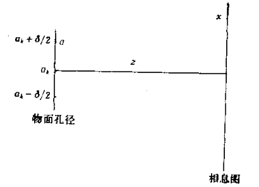
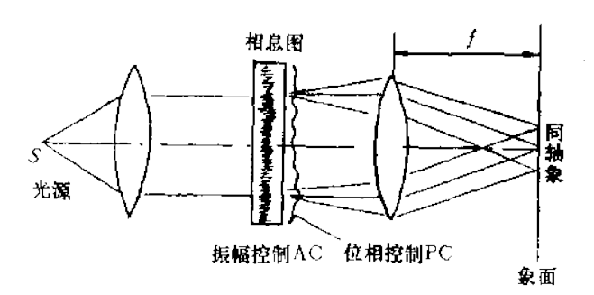
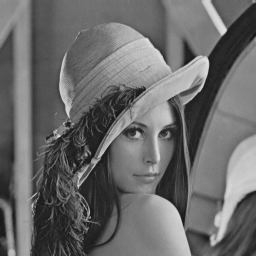
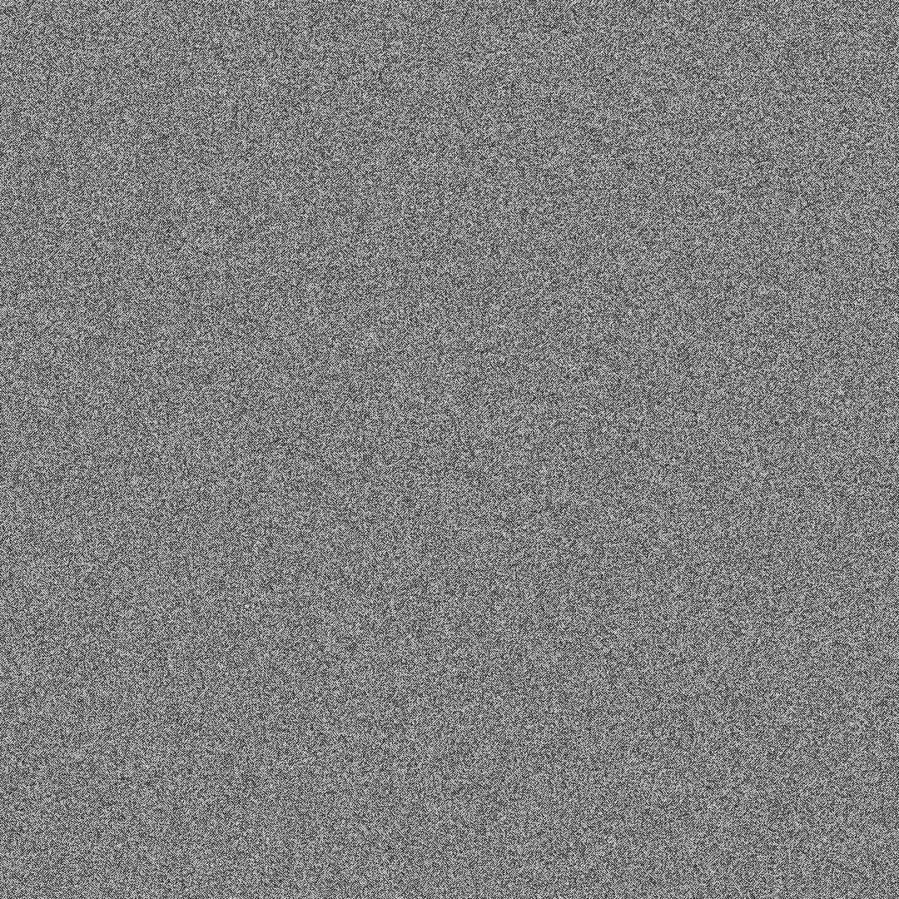
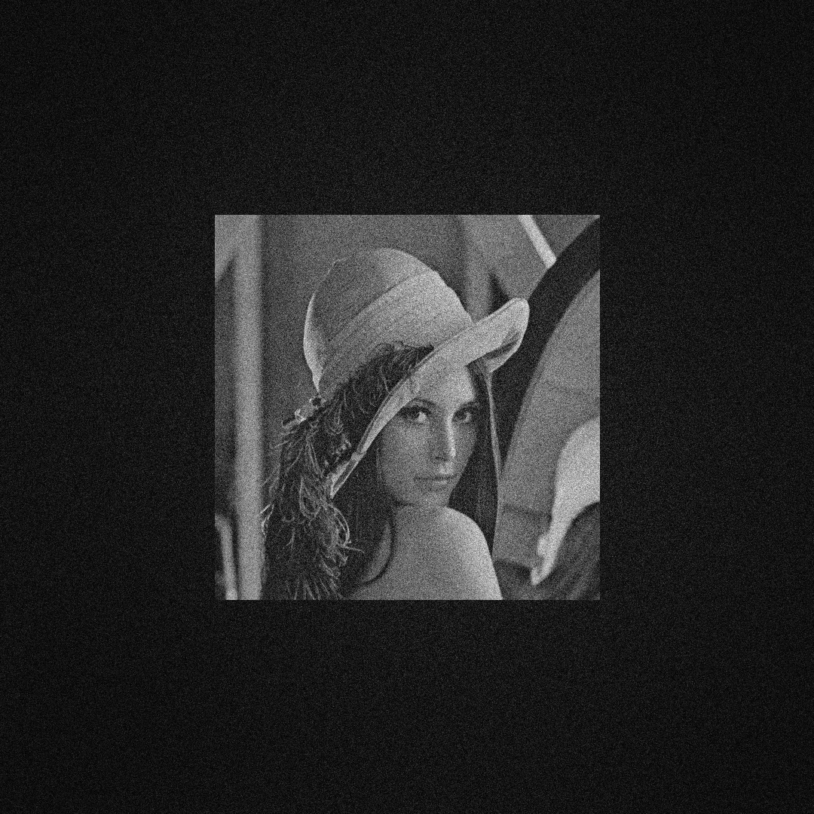

# Before Read

注：此文档分中英文撰写，根据需要跳转到相应位置阅读

Note: This document is written in Both Chinese and English, skip to the corresponding location to read if necessary

# 相息图

## 什么是相息图？

相息图是假设在整个记录平面内光波振幅为常数的条件下，仅记录波前位相信息的元件。因此，相息图再现时也只给出物波的位相信息，而丢失了物波的振幅信息（振幅为常数）。随着相息图技术的发展，后来的相息图不仅能保存物波的位相信息，而且同时能记录和再现物波的振幅信息，这种扩展了的相息图就完全保存了物体的全部信息，因而是一种新型的全息图。

光学全息和计算全息图都将光波信息转化为全息图的透过率变化或干涉条纹图形而记录在胶片上，但相息图却只将光波的位相信息以浮雕形式记录在胶片上。光学全息和计算全息的再现复数波场都是建立在光的衍射理论的基础上，而相息图却似菲涅尔透镜那样，只是通过改变光学厚度去变化照射光波的位相分布，从而再现出原始的物光波。因此相息图可以看成是一块由计算机制作的复杂透镜，其表面形状，对同轴再现的相息图来说，很像光学菲涅尔透镜，而对离轴像的再现来讲，相息图则像一块精密制作的闪耀光栅。

相息图的最大优点也许是其衍射效率特高。一张相息图完全是一透明片，不会衰减入射光强。照明相息图只得到单一的衍射级，再现单一的图像，没有共轭像或杂散图像叠加其上。因此它既不像光学全息中的由于实、虚共轭像的存在而减弱再现像的光强，也不像二元计算全息中有多余的衍射级存在而分散入射光强。在理想情况下，相息图可把全部入射光用来重建这个单个像，故衍射效率可达到100%。

## 原理

相息图是在个基本假定下制作的，即认为待记录的物体是理想的漫射体，从物体上发出的漫射光均匀地照射在整个相息图平面上，因此相息图平面内的光振幅为常数，而且物体的全部信息都均匀地扩展到整个相息图平面。这样，要构造这个漫射性质的物体，仅仅只要记录散射光波的位相信息就可以了。相息图平面内的光波复振幅分布为：
$$
U(x, y)=A \cdot \exp (j \phi(x, y))
$$
然而在通常的情况下，相息图平面内的光振幅A不可能总是常数，因此常数振幅的假设是有问題的。但我们可以改变原始物体的位相函数，努力做到此物体的散射光到达相息图平面时实质上是均匀分布的，即光振幅可为常数。在物理上，相当于通过漫射体（如毛玻璃）来照明物体，这个漫射体扩展了照明光波，并把入射光波的位相随机地散布在物体的各个部分，结果是相息图上的每一部分都接收到了物体的全部信息。

现在我们从数学处理上来寻找物体为漫射体的合适描述。常用的方法是把物体表示成二维（平面）或三维（立体）点孔阵列的集合。毎个小孔波场的复振幅为$T_k$,并向空间发射球面次波。
$$
T_{\mathrm{k}}=t_{\mathrm{k}} \exp \left(j \alpha_{\mathrm{k}}\right)
$$
其中，$t_k$表示第$k$个点孔的透射率，$t_k$=0表示点孔阻拦光波，$t_k$=1表示点孔完全透光，$t_k$在(0,1)之间取值，表示不同的透光情况。$\alpha_k$是各点的位相变化函数。把物体表示成点孔集合这一模式，优点在于以后作数学运算时比较方便，物理意义地很清楚，它自动地保证了光信息的空间漫射（毎个点源向整个空间发射球面波）.

给出了物体的数学表达式，下面就可说明相息图的实际计算和制作过程，为了简化，我们以一维为例，但它可以很方便地推广到二维或三维情况。下图表示物面到相息图的菲涅尔衍射。

物面上中心在$a_k$,线度为$\delta$的孔径，发射光波传播到距离为$E$处的的相息图平面$x$.根据克希霍夫衍射理论，相息图平面上的光波复振幅为
$$
U\left(x, a_{\mathrm{k}}\right)=C \int_{a_{\mathrm{k}}-\delta / 2}^{a_{\mathrm{k}}+\delta / 2} \exp \left[j \frac{2 \pi}{\lambda}\left\{(x-a)^{2}+z^{2}\right\}^{\frac{1}{2}}\right] d a
$$
如果$\delta$的孔径无限大，同时光波是一种电磁波，它满足麦克斯韦方程组，将光波表示成球面波的形式，根据推导可以获得标量场下光波的菲涅尔衍射积分的表达式如下：
$$
U(x, y)=\frac{\exp (j k d)}{j \lambda d} \iint_{-\infty}^{\infty} U_{0}\left(x_{0}, y_{0}\right) \exp \left(\frac{j k}{2 d}\left[\left(x-x_{0}\right)^{2}+\left(y-y_{0}\right)^{2}\right]\right) d x d y
$$
将上式改写为离散的傅里叶变换的形式为：
$$
\begin{array}{c}
U(p \Delta x, q \Delta y)=\frac{\exp (j k d)}{j \lambda d} \exp \left[\frac{j k}{2 d}\left(p \Delta x^{2}\right)+q \Delta y^{2}\right] \\
\times I\left[U_{0}\left(m \Delta x_{0}, n \Delta y_{0}\right) \times \exp \left(\frac{j k}{2 d}\left(m \Delta x_{0}\right)^{2},\left(n \Delta y_{0}\right)^{2}\right)\right]_{\frac{p \Delta x}{\lambda d}, \frac{p \Delta y}{\lambda d}}
\end{array}
$$
相息图平面上的复振幅分布（离散形式）为
$$
U(x, y)=U_{\mathrm{R}}(x, y)+j U_{\mathrm{I}}(x, y)
$$
其相角为：
$$
\phi(x, y)=\tan ^{-1}\left(U_{\mathrm{I}}(x, y) / U_{\mathrm{R}}(x, y)\right)
$$
由于上述的相息图不能记录光场的振幅信息，这总会给再现像的逼真度产生影响。但是相息图又有比全息图衍射效率高，同轴再现时无共轭像干扰等的优点，故自然就想到，要在保持相息图优点的条件下，进一步对相息图改进，消除其不足之处。下面几种相息图的扩展技术，它们都能同时记录物波的位相和振幅全部信息。

**无参考光同轴复式全息图 ROACH**

这种方法是想法寻找特殊的全息照相记录介质，它不仅能用漂白技术来形成浮雕像，达到调制光波位相的目的，而且也能引入光波的振幅调制。这种照相记录介质就是用多层乳胶的柯达Ⅱ彩色胶片( Kodacolor Ⅱ),其中不同的乳胶层只对不同的色光曝光。当用单色光照明处理以后的胶片时，一层乳胶将吸收光能，以调制入射波的振幅，而其余两层仍是透明的，只能产生入射光的位相信息。其工作原理图下图：

**纯位相型全息图**

另外一种相息图扩展技术是对相息图记录的位相再调制。制作的办法是在相息图上不直接记录物波经付里叶变换后的位相，而是记录由物波的付里叶变换振幅重新调制的位相。通常是在原先的位相项中加进额外的位相项，再现时用一项位相变化去调物波振幅。这祥制作的相息图也叫做纯位相型全息图。尽管全息图面上的振幅仍为常数，但这种纯位相型全息图同时包含了物波的全部信息。当然，由于在再现波中引进了振幅变化，再现时光波必然产生偏离，这将减少再现像的衍射效率。

## 如何制作相息图？

在这个实验中，我们使用这个图像进行测试:

这里提供了两种进行实验的方法，Matlab或Python，您可以选择熟悉的方法来运行代码。

- 运行[`kinoforms.m`](../../Matlab/kinoforms.m) 或 [`kinoforms.py`](../../Python/kinoforms.py)，它们分别在Python和Matlab文件夹中。

- 然后你会在下面得到Kinoform。

- 最后，运行程序后，可以得到复现的图像，并将其与原始图像进行比较。

# Kinoform

## What is Kinoform?

A kinoform is an element that records only the phase information of the wave front under the assumption that the amplitude of the light wave in the whole recording plane is constant. Therefore, only the phase information of the object wave is given, but the amplitude information of the object wave is lost (the amplitude is constant). With the development of kinoform technology, the later kinoform can not only save the phase information of object wave, but also record and reproduce the amplitude information of object wave. This extended kinoform completely preserves all the information of object, so it is a new type of hologram.

Both optical holography and CGH record the light wave information on film by converting the transmittance change or interference fringe pattern of hologram, but the phase pattern only records the light wave phase information in relief form on film. The reconstruction of complex wave field of optical holography and computational holography is based on the diffraction theory of light, while the kinoform is just like Fresnel lens, which only changes the phase distribution of the irradiating light wave by changing the optical thickness, so as to reproduce the original object light wave. Thus, a kinoform can be thought of as a complex computer-generated lens whose surface shape looks much like an optical Fresnel lens for a coaxial representation of the kinoform, and like a precisely fabricated sparkle grating for an off-axis representation.

Perhaps the greatest advantage of the kinoform is its high diffraction efficiency. A kinoform is completely transparent and does not attenuate the incident light intensity. Illumination kinoform only gets a single diffraction order, reproduces a single image, no conjugate image or stray image superimposed on it. Therefore, it is not like optical holography which weakens the light intensity of the reconstructed image due to the existence of real and virtual conjugated images, nor like binary CGH which disperses the incident light intensity due to the existence of redundant diffraction levels. Under ideal conditions, the kinoform can be used to reconstruct the single image with all incident light, so the diffraction efficiency can reach 100%.

## Principle

The kinoform is made under the basic assumption that the object to be recorded is an ideal diffuse body, the diffuse light from the object is uniformly illuminated on the whole kinoform plane, so the amplitude of the light in the kinoform plane is constant, and all the information of the object is uniformly extended to the whole kinoform plane. Thus, to construct the diffuse object, it is only necessary to record the phase information of the scattered light wave. The complex amplitude distribution of light wave in the kinoform plane is:
$$
U(x, y)=A \cdot \exp (j \phi(x, y))
$$
In general, however, the optical amplitude A in the kinoform plane cannot always be constant, so the assumption of constant amplitude is problematic. However, we can change the phase function of the original object and try to achieve that the scattered light of the object is essentially evenly distributed when it reaches the plane of the kinoform, that is, the amplitude of the light can be constant. In physics, it is equivalent to illuminating an object with a diffuse object (such as ground glass), which expands the illumination wave and randomly disperses the phase of the incident light wave over various parts of the object, so that each part of the kinoform receives all the information of the object.

Now let's look at the mathematical process to find a suitable description of the object as diffuse. A common method is to represent an object as a collection of two-dimensional (flat) or three-dimensional (solid) point-hole arrays. Each keyhole wave field has a complex amplitude of $T_k$and emits spherical secondary waves into space.
$$
T_{\mathrm{k}}=t_{\mathrm{k}} \exp \left(j \alpha_{\mathrm{k}}\right)
$$
$t_k$=0; $t_k$=1; $t_k$=0; $t_k$=1; $\alpha_k$is the phase change function of each point. The advantage of this model is that the object is represented as a set of point holes, which is convenient for mathematical calculation and has a clear physical meaning. It automatically ensures the spatial diffusion of optical information (every point source emits spherical waves to the whole space).

Given the mathematical expression of the object, the actual calculation and production process of the kinoform can be illustrated below. For simplicity, we use one dimension as an example, but it can be easily generalized to two or three dimensions. The figure below shows Fresnel diffraction from the surface to the kinoform.

The aperture centered at $a_k$and linear at $\delta$is transmitted to the kinoform plane $X $at distance $E$. According to kirchhoff diffraction theory, the complex amplitude of light wave on the kinoform plane is
$$
U\left(x, a_{\mathrm{k}}\right)=C \int_{a_{\mathrm{k}}-\delta / 2}^{a_{\mathrm{k}}+\delta / 2} \exp \left[j \frac{2 \pi}{\lambda}\left\{(x-a)^{2}+z^{2}\right\}^{\frac{1}{2}}\right] d a
$$
If the aperture of $\delta$is infinite and the light wave is a kind of electromagnetic wave, which satisfies Maxwell's equations and is expressed in the form of spherical wave, the Fresnel diffraction integral of the light wave under scalar field can be obtained as follows:

$$
U(x, y)=\frac{\exp (j k d)}{j \lambda d} \iint_{-\infty}^{\infty} U_{0}\left(x_{0}, y_{0}\right) \exp \left(\frac{j k}{2 d}\left[\left(x-x_{0}\right)^{2}+\left(y-y_{0}\right)^{2}\right]\right) d x d y
$$

The formula above can be rewritten as the discrete Fourier transform:

$$
\begin{array}{c}

U(p \Delta x, q \Delta y)=\frac{\exp (j k d)}{j \lambda d} \exp \left[\frac{j k}{2 d}\left(p \Delta x^{2}\right)+q \Delta y^{2}\right] \ \

\times I\left[U_{0}\left(m \Delta x_{0}, n \Delta y_{0}\right) \times \exp \left(\frac{j k}{2 d}\left(m \Delta x_{0}\right)^{2},\left(n \Delta y_{0}\right)^{2}\right)\right]_{\frac{p \Delta x}{\lambda d}, \frac{p \Delta y}{\lambda d}}

\end{array}
$$

The complex amplitude distribution (discrete form) on the kinoform plane is

$$
U(x, y)=U_{\mathrm{R}}(x, y)+j U_{\mathrm{I}}(x, y)
$$

Its phase Angle is:

$$
\phi(x, y)=\tan ^{-1}\left(U_{\mathrm{I}}(x, y) / U_{\mathrm{R}}(x, y)\right)
$$

Since the above kinoform cannot record the amplitude information of the light field, it will always affect the fidelity of the reconstructed image. However, the phase and kinoform has the advantages of higher diffraction efficiency than hologram and no conjugate image interference in coaxial reproduction. Therefore, it naturally occurred to us to further improve the phase and kinoform to eliminate its shortcomings while maintaining the advantages of the phase and kinoform. The following are several extended kinoform techniques that simultaneously record all phase and amplitude information of object waves.

**Coaxial compound hologram without reference light ROACH**

This method is to find a special hologram recording medium, which can not only use bleaching technology to form floating statues to achieve the purpose of modulation of light wave phase, but also can introduce the amplitude modulation of light wave. The photographic recording medium is Kodacolor ii, which uses multiple layers of latex, in which different layers of latex are exposed only to different colors. When the resulting film is illuminated with monochromatic light, one layer of latex absorbs light energy to modulate the amplitude of the incident wave, while the other two layers remain transparent, producing only phase information about the incident light. Its working principle diagram is as follows:

**Pure phase hologram**

Another phase - and - kinoform extension technique is phase - modulation of the phase - and - kinoform record. The method is to record the phase of the object wave modulated by the Fourier transform amplitude of the object wave on the kinoform instead of directly recording the phase after the Fourier transform. Usually, an additional phase term is added to the original phase term and a phase change is used to modulate the amplitude of the matter wave during reproduction. Such a kinoform is also called a pure phase hologram. Although the amplitude of the hologram is constant, the hologram of pure phase contains all the information of matter wave. Of course, due to the introduction of amplitude changes in the reconstructed wave, the light wave will inevitably deviate during the reconstruction, which will reduce the diffraction efficiency of the reconstructed image.

## How to make Kinoform?

For this experiment we used this image for testing

Two ways to do experiments are provided here, Matlab or Python, and you can choose the familiar way to run the code.

- Run the [`kinoforms.m`](../../Matlab/kinoforms.m) or [`kinoforms.py`](../../Python/kinoforms.py), They are in the Python and Matlab folders respectively.
- Then you will get Kinoform below.

- Finally, after running the program, you can get the reproduced graph and compare it with the original image.

### 
