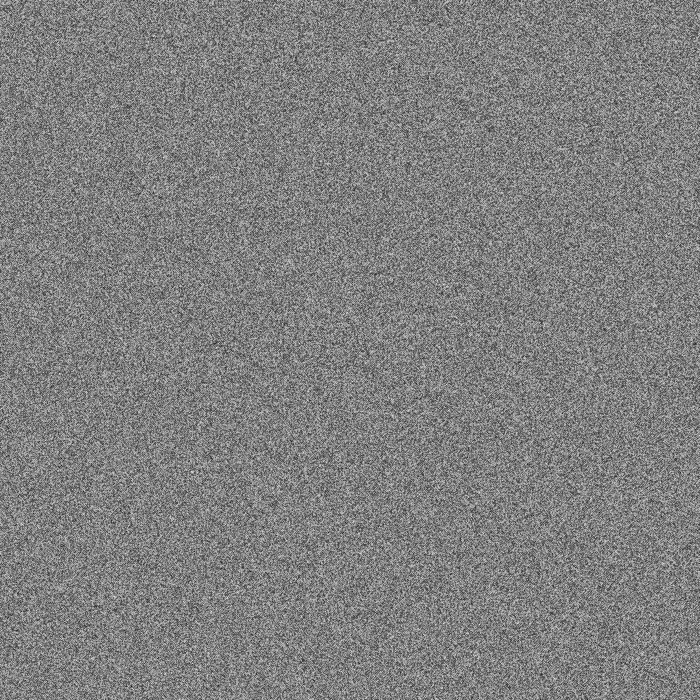
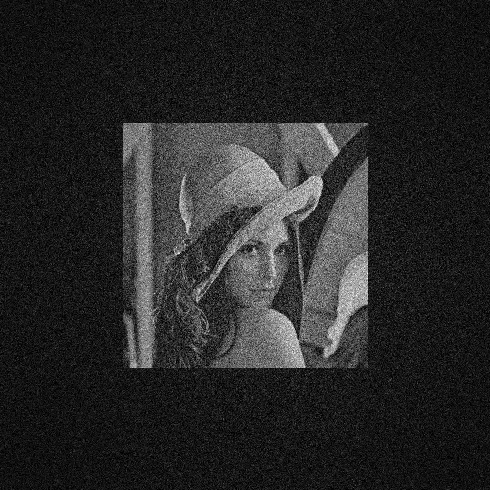

# Computer-Generated-Hologram
✨This library introduces the current production process of computer holography, and uses MATLAB and Python to record and reproduce holograms. In the future, I will build a computer hologram simulation framework or a simulation application program.

## Introduction

CGH stands for computer-generated holograms (CGH). Holograms are unique in their ability to record both the intensity and phase of information.

|                    CGH Class                    |              Intro               | Link |
| :---------------------------------------------: | :------------------------------: | :--: |
| Circuitous Phase Type Hologram/Fourier Hologram |  迂回位相型全息图/傅里叶全息图   | Code |
|                    Kinoform                     | 相息图（没有参考光，只记录相位） | Code |
|                Fresnel Hologram                 |     菲涅尔全息图（模拟光学）     | Code |

## Experiment

### Before Experiment

Before experimenting, it's best to understand common image formats and their fundamentals. Understanding the pixel level of an image will help you experiment better and give you a better understanding of the fundamentals of image processing.

【在实验之前，你最好了解常见的图片格式和它们的基本原理，了解对图像像素级别的认知能够帮助你更好的实验，并且让你对图像处理的基本原理有更好的理解。】

Here are some examples of images you should pay more attention to the suffix of the image, and the size of the image, so that you can work with the image later.

【这里给出了一些图片的例子，你应该多关注图片的后缀名，和图片的尺寸，方便后续对图片的处理。】

### Fourier Hologram

Circuitous Phase Type Hologram/Fourier Hologram is Binary hologram.

#### DataSet

For this experiment we used this image for testing

#### Experimental Principle

Todo

#### Experimental Procedure

Two ways to do experiments are provided here, Matlab or Python, and you can choose the familiar way to run the code.

- Run the `fourier_hologram.m` or `fourier_hologram.py`, They are in the Python and Matlab folders respectively.
- Then you will get Circuitous Phase Type Hologram/Fourier Hologram below.

+ Finally, after running the program, you can get the reproduced graph and compare it with the original image.

### Kinoform

#### DataSet

For this experiment we used this image for testing

#### Experimental Principle

Todo

#### Experimental Procedure

Two ways to do experiments are provided here, Matlab or Python, and you can choose the familiar way to run the code.

- Run the `kinoforms.m` or `kinoforms.py`, They are in the Python and Matlab folders respectively.
- Then you will get Kinoform below.

- Finally, after running the program, you can get the reproduced graph and compare it with the original image.

