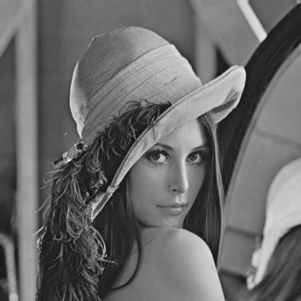
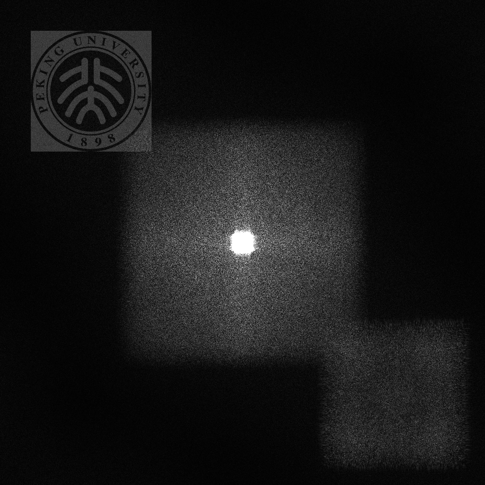

# Computer-Generated-Hologram
✨This library introduces the current production process of computer holography, and uses MATLAB and Python to record and reproduce holograms. In the future, I will build a computer hologram simulation framework or a simulation application program.

## Introduction

CGH stands for computer-generated holograms (CGH). Holograms are unique in their ability to record both the intensity and phase of information.

### Iterative Method

The iterative algorithm usually starts from an approximation of the target hologram, and continuously optimizes the approximate hologram through a series of repeated operations until the reconstructed image obtained by the approximation meets certain error requirements.

#### GS-Base Algorithm

According to the amplitude distribution of the hologram plane and the reconstructed image plane, the phase information of the light field in the hologram plane can be obtained by iterating the forward and reverse light wave transmission and the restrictions imposed on the two planes.

|           CGH Class            |                           Document                           | Link |
| :----------------------------: | :----------------------------------------------------------: | :--: |
| GS(Gerchberg-Saxton) Algorithm | 👉[Paper](https://scholar.google.com/scholar?q=A%20practical%20algorithm%20for%20the%20determination%20of%20phase%20from%20image%20and%20diffraction%20plane%20pictures) | [Code](./Python/iterative_methods/GS.py) |
|        Fienup Algorithm        | 👉[Paper](https://labsites.rochester.edu/fienup/wp-content/uploads/2019/07/OEngr1980_ITAimRecCGH.pdf) | [Code](./Python/iterative_methods/Fienup.py) |

#### Error Diffusion Method

Todo

### Non Iterative Method

|                          CGH Class                           |                  Document                   | Link |
| :----------------------------------------------------------: | :-----------------------------------------: | :--: |
| Circuitous Phase Type Hologram/Fourier Hologram【迂回位相型全息图】 |   👉[Doc](Doc/Fourier_Hologram/README.md)    | Code |
|                      Kinoform【相息图】                      |       👉[Doc](Doc/Kinoform/README.md)        | Code |
|               Fresnel Hologram【菲涅尔全息图】               |                    👉Doc                     | Code |
|       Off Axis Interference Hologram【离轴干涉全息图】       | 👉[Doc](Doc/Interference_Hologram/README.md) | Code |

## Usage

Working on a hologram simulation API.

## Experiment

### Before Experiment

Before experimenting, it's best to understand common image formats and their fundamentals. Understanding the pixel level of an image will help you experiment better and give you a better understanding of the fundamentals of image processing.

Here are some examples of images you should pay more attention to the suffix of the image, and the size of the image, so that you can work with the image later.

### Fourier Hologram

Circuitous Phase Type Hologram/Fourier Hologram is Binary hologram.

#### DataSet

For this experiment we used this image for testing

#### Experimental Principle

Please read this [Doc](Doc/Fourier_Hologram/README.md)ument.

#### Experimental Procedure

Two ways to do experiments are provided here, Matlab or Python, and you can choose the familiar way to run the code.

- Run the `fourier_hologram.m` or `fourier_hologram.py`, They are in the Python and Matlab folders respectively.
- Then you will get Circuitous Phase Type Hologram/Fourier Hologram below.

+ Finally, after running the program, you can get the reproduced graph and compare it with the original image.

### Kinoform

#### DataSet

For this experiment we used this image for testing

#### Experimental Principle

Please read this [Doc](Doc/Kinoform/README.md)ument.

#### Experimental Procedure

Two ways to do experiments are provided here, Matlab or Python, and you can choose the familiar way to run the code.

- Run the `kinoforms.m` or `kinoforms.py`, They are in the Python and Matlab folders respectively.
- Then you will get Kinoform below.

- Finally, after running the program, you can get the reproduced graph and compare it with the original image.

### Off Axis Interference Hologram

#### DataSet

For this experiment we used this image for testing

#### Experimental Principle

Please read this [Doc](Doc/Interference_Hologram/README.md)ument.

#### Experimental Procedure

Two ways to do experiments are provided here, Matlab or Python, and you can choose the familiar way to run the code.

- Run the `offaxis_interference_hologram.m` or `offaxis_interference_hologram.py`, They are in the Python and Matlab folders respectively.
- Then you will get Off Axis Interference Hologram below.

- Finally, after running the program, you can get the reproduced graph and compare it with the original image.

## Contact

If you have any questions or good ideas, please contact: jackcc0701@163.com

