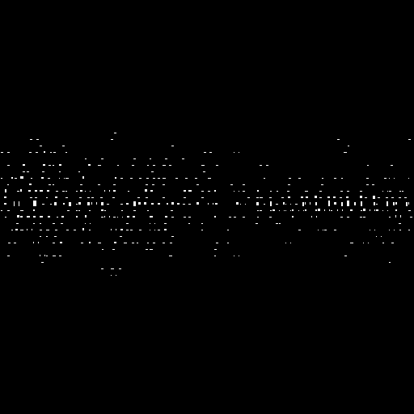
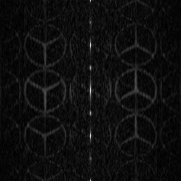

# Computer-Generated-Hologram
Computer hologram recording and reproduction. This is a demo for simple implementation.

## Introduction

## Experiment
### 傅里叶全息图的记录与再现
- 测试图片 
    

- Matlab实现
    + 运行fourier_hologram.m
    + 得到CGH: 
    
    + 放大CGH: 
    
    + 再现: 
    
      
- Python实现
    + 运行fourier_hologram.py
    + 得到CGH: 
    
    + 放大CGH: 
    
    + 再现: 
    